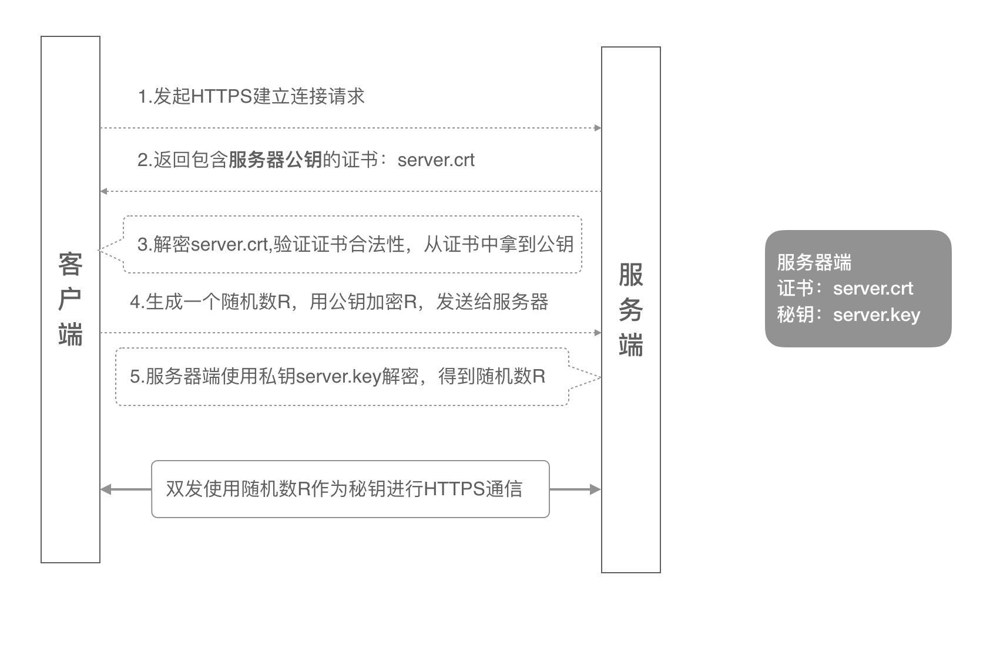
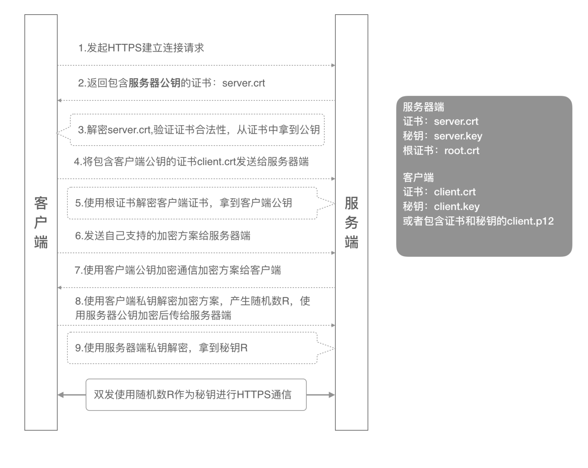

# https双向认证 本地创建自定义证书 nginx配置https双向认证
## 前言
本篇博文将为你解答这些问题：

1. https单相认证和双向认证的讲解
2. https证书 自签名证书
3. nginx如何配置https双向认证？
4. 如何验证https双向认证？
5. uni-app 配置 https 自签名客户端证书
6. mac如何安装客户端证书
7. chrome浏览器访问自签名证书地址显示【您的连接不是私密连接】解决办法


## 正文
1. https单相认证和双向认证的讲解
   
   单向认证流程：
   
   
   
1). 客户端发起建立HTTPS连接请求，将SSL协议版本的信息发送给服务器端；

2). 服务器端将本机的公钥证书（server.crt）发送给客户端；

3). 客户端读取公钥证书（server.crt），取出了服务端公钥；

4). 客户端生成一个随机数（密钥R），用刚才得到的服务器公钥去加密这个随机数形成密文，发送给服务端；

5). 服务端用自己的私钥（server.key）去解密这个密文，得到了密钥R

6). 服务端和客户端在后续通讯过程中就使用这个密钥R进行通信了。


   双向认证流程
   

1). 客户端发起建立HTTPS连接请求，将SSL协议版本的信息发送给服务端；

2). 服务器端将本机的公钥证书（server.crt）发送给客户端；

3). 客户端读取公钥证书（server.crt），取出了服务端公钥；

4). 客户端将客户端公钥证书（client.crt）发送给服务器端；

5). 服务器端使用根证书（root.crt）解密客户端公钥证书，拿到客户端公钥；

6). 客户端发送自己支持的加密方案给服务器端；

7). 服务器端根据自己和客户端的能力，选择一个双方都能接受的加密方案，使用客户端的公钥加密

8). 后发送给客户端；

9). 客户端使用自己的私钥解密加密方案，生成一个随机数R，使用服务器公钥加密后传给服务器端；

10). 服务端用自己的私钥去解密这个密文，得到了密钥R

11). 服务端和客户端在后续通讯过程中就使用这个密钥R进行通信了。


#### 整个双向认证的流程需要八个证书文件：

- 服务器端公钥证书：server.crt
- 服务器端私钥文件：server.key
- 根证书：root2way.crt
- 中间端公钥证书：middle.crt
- 中间端私钥文件：middle.key
- 客户端根证书：root.crt     （本例不包含）
- 客户端公钥证书：client.crt （本例不包含）
- 客户端私钥文件：client.key （本例不包含）

### https证书获取途径：自签名证书
#### 使用 openssl 工具生成证书文件

##### 生成自签名根证书

0. 创建 `certs/2way` 目录，后续的操作都在此目录， docker 拷贝的cert 也从这个目录拷贝进去

```
mkdir -p certs/2way
cd certs/2way
```

1. 创建根证书

`openssl genrsa -out root2way.key 1024`

2. 创建根证书请求文件

`openssl req -new -out root2way.csr -key root2way.key`

这里有许多参数需要填写，请自行填写：A challenge password 密码可以不设置
```shell
Country Name (2 letter code) [AU]:US
State or Province Name (full name) [Some-State]:CA
Locality Name (eg, city) []:LA
Organization Name (eg, company) [Internet Widgits Pty Ltd]:DDL Internet network Ltd.,
Organizational Unit Name (eg, section) []:Cisco CCIE training
Common Name (e.g. server FQDN or YOUR name) []:root2way.com
Email Address []:                   <leave it blank>

Please enter the following 'extra' attributes
to be sent with your certificate request
A challenge password []:            <leave it blank>
An optional company name []:        <leave it blank>

```
3. 创建根证书

`openssl x509 -req -in root.csr -out root2way.crt -signkey root2way.key -CAcreateserial -days 3650`


### 生成服务端证书

1. 生成服务器端证书私钥

`openssl genrsa -out backend.key 1024`

2. 生成服务器证书请求文件

`openssl req -new -out backend.csr -key backend.key`

```shell
Country Name (2 letter code) [AU]:CN
State or Province Name (full name) [Some-State]:Shanghai
Locality Name (eg, city) []:HZ
Organization Name (eg, company) [Internet Widgits Pty Ltd]:Huawei Internet Ltd.,
Organizational Unit Name (eg, section) []:HHIE training dpt
Common Name (e.g. server FQDN or YOUR name) []:backend
Email Address []:backend@ddl.com

Please enter the following 'extra' attributes
to be sent with your certificate request
A challenge password []:123456
An optional company name []:Huawei Shanghai network ltd.,
```
3. 生成服务器端公钥证书

`openssl x509 -req -in backend.csr -out backend.crt -CA root2way.crt -CAkey root2way.key -CAcreateserial -days 3650`

经过上面的三个命令，我们得到：

`backend.key`：服务器端的密钥文件

`backend.crt`：有效期十年的服务器端公钥证书，使用根证书和服务器端私钥文件一起生成


### 生成中间端证书

1. 生成中间端证书密钥：

`openssl genrsa -out middle.key 1024`

2. 生成中间证书请求文件

`openssl req -new -out middle.csr -key middle.key`

```shell
Country Name (2 letter code) [AU]:SG
State or Province Name (full name) [Some-State]:Singapoure
Locality Name (eg, city) []:Changi
Organization Name (eg, company) [Internet Widgits Pty Ltd]:Intel Chips Internet Ltd.,
Organizational Unit Name (eg, section) []:CPU
Common Name (e.g. server FQDN or YOUR name) []:frontend
Email Address []:ddl@intel.com

Please enter the following 'extra' attributes
to be sent with your certificate request
A challenge password []:123456
An optional company name []:
```

3. 生中间端证书

`openssl x509 -req -in middle.csr -out middle.crt -CA root2way.crt -CAkey root2way.key -CAcreateserial -days 3650`

经过上面的三个命令，我们得到：

`middle.key`：中间端的私钥文件

`middle.crt`：有效期十年的中间端证书


### 生成客户端证书

（略）


