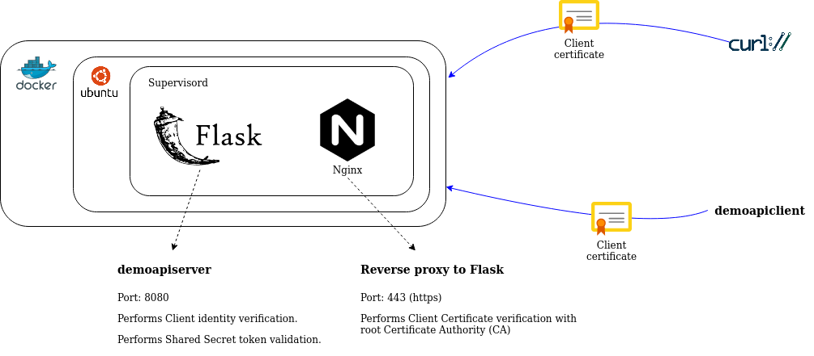

# 2-way Nginx python SSL

This is an implementation to demonstrate how 2-way SSL works. The following serves to depict the high-level architecture
and the components used in this project. 



```
               client.crt     middle.crt  backend.crt
┌─────────┐           ┌─────────┐           ┌─────────┐       ┌─────────┐
│         │           │         │           │         │       │         │
│ Browser ├──────────►│ nginx 1 ├──────────►│ nginx 2 ├──────►│ Website │
│demoapi- │           │         │           │         │       │ demoapi-│
│  client │           │         │           │         │       │   server│
│         │           │         │           │         │       │         │
│         │    HTTPS  │         │ mTLS      │         │ HTTPS │         │
└─────────┘           └─────────┘           └─────────┘       └─────────┘
```

- `demoapiclient` - A simple python program to make Restful call to `demoapiserver`. (for details, please refer [client README](./client/README.md))
- `demoapiserver` - A Flask application demonstrating 2-way SSL identity verification. (for details, please refer [server README](./server/README.md))

To run this project, you will need:

1. Docker
2. OpenSSL
3. `curl` command

(_Note: All commands listed in this README are only tested in an Ubuntu 18.04 environment._)

The following are the steps required to build and run this project:

1. [Generate Certificates](#generate-self-signed-ca-certificates)

2. [Build a docker image containing Ubuntu installed with Nginx and python Flask app](#build-the-docker-image)

3. [Running `demoapiserver`](#running-the-environment)

4. [Verifying your setup works](#verifying-the-setup)

---

## Building the environment

### Generate self-signed CA certificates

**Generate a RANDFILE**

This is for serving as seed data when generating the certificates in the steps below. Only required if you're
paranoid about security.
* 作用：生成一个随机种子文件 ~/.rnd，用于增强 OpenSSL 生成密钥时的随机性（仅对安全性要求极高的场景有用）。
- if=/dev/urandom：从 Linux 的随机设备读取数据。
- of=~/.rnd：输出到用户主目录的 .rnd 文件。
- bs=256 count=1：生成 256 字节的随机数据。
```
dd if=/dev/urandom of=~/.rnd bs=256 count=1
```

**Generating the Root CA**
- 作用：生成 4096 位的 RSA 私钥，用于 CA 签名。
- genrsa：生成 RSA 密钥。
- -out certs/ca.key：输出到 certs/ca.key。
- 4096：密钥长度（2048 位是标准，4096 位更安全）。
```
openssl genrsa -out certs/ca.key 4096
```

- 作用：生成自签名的 CA 证书（.crt），有效期 10 年（3650 天）。
- req -x509：生成自签名证书（-x509 表示自签名）。
- -new -nodes：创建新证书，不加密私钥（-nodes = "no DES"）。
- -days 3650：有效期 10 年。
- -key certs/ca.key：使用 ca.key 作为私钥。
- -out certs/ca.crt：输出证书到 certs/ca.crt。
- -subj：指定证书信息：
  - C=SG：国家（Country，新加坡）。
  - O=God：组织（Organization）。
  - OU=Private Certificate Authority：组织单位（Organizational Unit）。
  - CN=God.com：通用名称（Common Name，CA 的名称）。
```
openssl req -x509 -new -nodes -days 3650 -key certs/ca.key -out certs/ca.crt -subj "/C=SG/O=God/OU=Private Certificate Authority/CN=god.com"
```

**Generating the backend nginx 2 Server certificate**

```
openssl genrsa -out certs/backend_nginx2_server.key 4096  #生成服务器私钥: 生成 4096 位的 RSA 私钥，用于服务器。
```
- 生成证书签名请求（CSR）
- 作用：生成 CSR（Certificate Signing Request），用于向 CA 申请签名。
  - -config cert_config/backend_nginx2_server_cert.conf：使用配置文件（包含 Subject Alternative Name, SAN 等信息）。
```
openssl req -new -key certs/backend_nginx2_server.key -out certs/backend_nginx2_server.csr -config cert_config/backend_nginx2_server_cert.conf
# For this example the `Common Name (e.g. server FQDN or YOUR name)` must be `backend.nginx2.ddl.com`.
```
- 用 CA 签发服务器证书
  - 作用：用 CA 私钥签名 backend_nginx2_server.csr，生成 backend_nginx2_server.crt。
  - x509 -req：处理 CSR 并签发证书。
  - -CA certs/ca.crt -CAkey certs/ca.key：指定 CA 证书和私钥。
  - -CAcreateserial：生成证书序列号文件（.srl）。
  - -extensions v3_req -extfile cert_config/backend_nginx2_server_cert_v3_ext.conf：指定扩展信息（如 SAN）。
  - using `backend.nginx2.ddl.com` as the CN, `*.nginx2.ddl.com` as the SAN (Subject Alternative Name).
```
openssl x509 -req -days 3650 -in certs/backend_nginx2_server.csr -CA certs/ca.crt -CAkey certs/ca.key -CAcreateserial -out certs/backend_nginx2_server.crt -extensions v3_req -extfile cert_config/backend_nginx2_server_cert_v3_ext.conf
```

To view the certificate:

```
openssl x509 -noout -text -in certs/backend_nginx2_server.crt
```

**The two files are important in the demo**
```
backend_nginx2_server.crt
backend_nginx2_server.key
```

**Generating the middle nginx 1 Server certificate**

```
openssl genrsa -out certs/middle_nginx1_server.key 4096  #生成服务器私钥: 生成 4096 位的 RSA 私钥，用于服务器。
```
- 生成证书签名请求（CSR）
- 作用：生成 CSR（Certificate Signing Request），用于向 CA 申请签名。
  - -config cert_config/middle_nginx1_server_cert.conf：使用配置文件（包含 Subject Alternative Name, SAN 等信息）。
```
openssl req -new -key certs/middle_nginx1_server.key -out certs/middle_nginx1_server.csr -config cert_config/middle_nginx1_server_cert.conf
# For this example the `Common Name (e.g. server FQDN or YOUR name)` must be `middle.nginx1.ddl.com`.
```
- 用 CA 签发服务器证书
  - 作用：用 CA 私钥签名 middle_nginx1_server.csr，生成 middle_nginx1_server.crt。
  - x509 -req：处理 CSR 并签发证书。
  - -CA certs/ca.crt -CAkey certs/ca.key：指定 CA 证书和私钥。
  - -CAcreateserial：生成证书序列号文件（.srl）。
  - -extensions v3_req -extfile cert_config/middle_nginx1_server_cert_v3_ext.conf：指定扩展信息（如 SAN）。
```
openssl x509 -req -days 3650 -in certs/middle_nginx1_server.csr -CA certs/ca.crt -CAkey certs/ca.key -CAcreateserial -out certs/middle_nginx1_server.crt -extensions v3_req -extfile cert_config/middle_nginx1_server_cert_v3_ext.conf
```

To view the certificate:

```
openssl x509 -noout -text -in certs/middle_nginx1_server.crt
```

**The two files are important in the demo**
```
middle_nginx1_server.crt
middle_nginx1_server.key
```


Note: In actual production, you will want the Server Certificate to be signed by a proper Certificate Authority (CA)
such as IdenTrust, DigiCert, Letsencrypt, etc. 

**Generating the Client certificate**

```
# 生成客户端私钥
openssl genrsa -out certs/client.key 4096
# 生成 CSR
openssl req -new -key certs/client.key -out certs/client.csr -config cert_config/client_cert.conf
用 CA 签发客户端证书
openssl x509 -req -days 3650 -in certs/client.csr -CA certs/ca.crt -CAkey certs/ca.key -CAcreateserial -out certs/client.crt -extensions v3_req -extfile cert_config/client_cert_v3_ext.conf
```

To view the certificate:

```
openssl x509 -noout -text -in certs/client.crt
```

**Generating Client certificate with invalid CA**

This Client Certificate is used to demonstrate what will happen if the Client is untrusted.

```
#生成恶意 CA, 生成一个不受信任的 CA（ca_bad.key 和 ca_bad.crt）。
openssl genrsa -out certs/ca_bad.key 4096
openssl req -x509 -new -nodes -days 3650 -key certs/ca_bad.key -out certs/ca_bad.crt -subj "/C=UB/O=Bad Actor/OU=Bad Certificate Authority/CN=evil.com"

# 用恶意 CA 签发客户端证书
openssl genrsa -out certs/client_bad.key 4096
openssl req -new -key certs/client_bad.key -out certs/client_bad.csr -config cert_config/client_cert.conf
openssl x509 -req -days 3650 -in certs/client_bad.csr -CA certs/ca_bad.crt -CAkey certs/ca_bad.key -CAcreateserial -out certs/client_bad.crt -extensions v3_req -extfile cert_config/client_cert_v3_ext.conf
```

To view the certificate:

```
openssl x509 -noout -text -in certs/client_bad.crt
```

### Build the Docker image

```
docker build -f Dockerfile-python-api --target python2wayssl_base -t python2wayssl_base .
docker build -f Dockerfile-python-api --target py2wayssl -t py2wayssl .
```

## Running the environment

```
docker compose up --build
```

## Verifying the setup

**No client certificate supplied**

if you want to test the client or server on your local, pls add the two entry in the `/etc/hosts`
```
127.0.0.1       backend.nginx2.ddl.com
127.0.0.1       middle.nginx1.ddl.com
```

Request:

```
curl https://middle.nginx1.ddl.com/hello --cacert certs/ca.crt
```

Response:

```html
<html>
<head><title>400 No required SSL certificate was sent</title></head>
<body bgcolor="white">
<center><h1>400 Bad Request</h1></center>
<center>No required SSL certificate was sent</center>
<hr><center>nginx</center>
</body>
</html>
```

**Invalid client certificate supplied**

Request:

```
curl https://middle.nginx1.ddl.com/hello --cacert certs/ca.crt --key certs/client_bad.key --cert certs/client_bad.crt
```

Response:

```html
<html>
<head><title>400 The SSL certificate error</title></head>
<body bgcolor="white">
<center><h1>400 Bad Request</h1></center>
<center>The SSL certificate error</center>
<hr><center>nginx</center>
</body>
</html>
```

**Valid client certificate supplied**

Request:

```
curl https://middle.nginx1.ddl.com/hello --cacert certs/ca.crt --key certs/client.key --cert certs/client.crt
```

Response:

```json
{"success":true}
```
